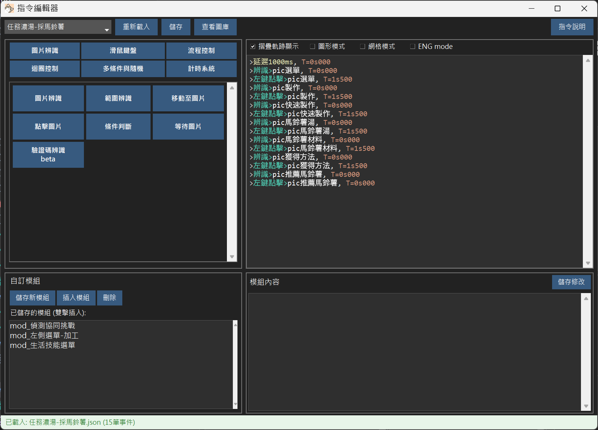

# ChroLens Mimic

<div align="center">




**🎯 強大的 Windows 自動化工具 | Powerful Windows Automation Tool**

[](https://github.com/LucienWooo/ChroLens_Mimic/releases)
[](./LICENSE)
[](https://discord.gg/72Kbs4WPPn)

[💬 Discord 社群](https://discord.gg/72Kbs4WPPn)

</div>

---

## ✨ 特色功能

### 🎮 核心功能

- **🎬 錄製與播放** - 一鍵錄製滑鼠/鍵盤操作,自動生成腳本
- **🖼️ 圖片辨識** - 智能找圖並點擊,適應不同解析度
- **🤖 AI 物件偵測** - 整合 YOLO,更準確的目標識別
- **📝 OCR 文字辨識** - 辨識螢幕文字,實現智能判斷
- **⌨️ 專屬指令編輯器** - 強大且直覺的純文字指令語法，快速編寫與生成自動化流程

### 🔥 進階功能

- **⚡ 觸發器系統** - 定時觸發、條件觸發、優先偵測
- **🔄 流程控制** - 循環、條件判斷、標籤跳轉
- **🔢 變數系統** - 記錄狀態、計數、動態判斷
- **⚙️ 多種執行模式** - 支援 pynput、pyautogui、win32api

---

## 🚀 快速開始

### 使用安裝包

1. 下載最新版本: [Releases](https://github.com/LucienWooo/ChroLens_Mimic/releases)
2. 解壓縮
3. 執行 `ChroLens_Mimic.exe`

---

## 📚 使用場景

### 🎮 遊戲自動化

- ✅ 自動任務、自動升級
- ✅ 自動簽到、自動領取獎勵
- ✅ 掛機腳本、循環打怪

### 💼 辦公自動化

- ✅ Excel 批次處理
- ✅ 自動填寫表單
- ✅ 重複性資料整理

---

### 專案結構

```
ChroLens_Mimic/
├── main/                  # 主程式
│   ├── ChroLens_Mimic.py # 主視窗
│   ├── recorder.py       # 錄製/播放引擎
│   ├── text_script_editor.py # 文字編輯器
│   ├── yolo_detector.py  # YOLO 偵測器
│   └── ocr_trigger.py    # OCR 辨識器
├── templates/            # 範例模板
├── web/                  # Web 文件
├── pic/                  # 圖片資源
└── installer/            # 安裝程式
```

---

## 💸 支持作者

如果這個專案幫助了你,請支持作者!

[](https://ko-fi.com/B0B51FBVA8)

### 免費贊助方式：

#### 這是蝦皮商城的連結

#### 從這邊進去逛或買,或是進去之後再去購物車結帳

#### 蝦皮就會付給我廣告引流的金額(0.1元) [分潤連結✅](https://s.shopee.tw/3qLtXtL3XE)

**這些程式幫你省下的時間,分一點來抖內吧!給我錢錢!** 💰  
**These scripts saved you time—share a bit and donate. Give me money!** 💰  
**このツールで浮いた時間、ちょっとだけ投げ銭して?お金ちょうだい!** 💰

---

## 📞 聯絡與支援

- 💬 **Discord 社群**: [加入 ChroLens Discord](https://discord.gg/72Kbs4WPPn)
- 🌐 **功能介紹**: [巴哈姆特文章](https://home.gamer.com.tw/artwork.php?sn=6329425)

---

## 📜 授權條款

本專案採用 [MIT License](./LICENSE) 授權

---

## 🌏 多語言支援

<details>
<summary>🇯🇵 日本語の紹介</summary>


**ChroLens_Mimic** は、Windows 上のマウス・キーボードの操作を滑らかかつシンプルに記録・再生できる **"マクロ録画＆再生ツール"** です。

**TinyTask** や **AutoHotkey（AHK）のレコーディング機能** に似た使いやすさを目指していて、プログラミング不要で、単純な繰り返し作業から軽度の自動化まで幅広く活用できます。

特にゲーマーの定番である TinyTask の直感的な操作性や、AHK のようにホットキーだけで起動・停止できる便利さが、ChroLens_Mimic の強みです。

使い方は録画開始（Record）→停止（Stop）→再生（Play）、繰り返し指定、ホットキー設定も可能。

</details>

<details>
<summary>🇺🇸 English Introduction</summary>


**ChroLens_Mimic** is a lightweight macro recorder for Windows that lets you record and replay mouse and keyboard actions—much like **TinyTask** or AutoHotkey's built-in macro recorder.

Aimed at users who want no‑code automation, ChroLens_Mimic combines TinyTask's simplicity (just record → stop → play) with AutoHotkey's hotkey‑based control.

You can loop playback, assign hotkeys, and save your macros for everyday automation tasks—whether for work or casual use.

If you're familiar with TinyTask's one‑click simplicity or AHK's scripting flexibility, you'll find ChroLens_Mimic a natural fit for reducing repetitive tasks.

</details>

---

<div align="center">

**⭐ 如果這個專案對你有幫助,請給個 Star! ⭐**

Made with ❤️ by [LucienWooo](https://github.com/LucienWooo)

</div>

### v2.8.4 更新內容
- **圖庫介面大幅強化**: 全新的 20/80 網格比例佈局，左側面板新增了資料夾切換、圖片搜尋、直接開啟資料夾按鈕。
- **UI 防護與修復**: 擴大了視窗保護策略確認彈窗，解決內容擠壓問題。並修復視窗開啟記憶位置的系統衝突。
- **程式碼瘦身**: 盤點並清理了廢棄的重構腳本（`modules/editor`）與舊版測試 UI（`visual_tracker_ui`）。
